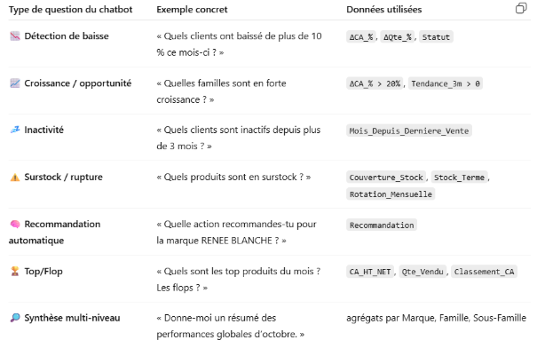
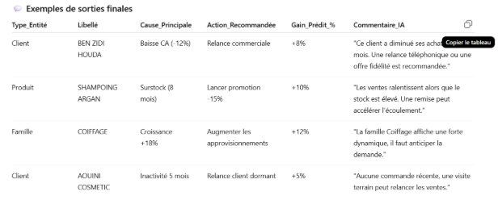


` `TABLE CLIENT / QUESTIONS RELATIVES AUX CLIENTS :

` `**Exemples de questions** 

1. ` `*« Quels sont les clients inactifs depuis plus de 3 mois ? »*
1. ` `*« Quel est le chiffre d’affaires moyen du client AYADI HOUWAIDA ? »*
1. ` `*« Quels clients ont augmenté leurs achats de plus de 20 % cette année ? »*
1. ` `*« Quels clients gère le commercial RABIAA BEN SEDRINE ? »*
1. ` `*« Quels sont les clients à risque de perte ? »*
1. ` `*« Top 10 des clients les plus fidèles ? »*

|**Type de question du chatbot**|**Exemple concret**|**Donnée utilisée dans la table**|
| :- | :- | :- |
|🟢 **Identification du client**|« Qui est le client CL025 ? »|Code\_Client, Intitulé\_Client, Categorie\_Client, Zone, Représentant|
|🟢 **Fidélité / ancienneté**|« Depuis quand ce client travaille avec nous ? »|Date\_Premiere\_Vente, Annees\_Actives|
|🟢 **Activité récente**|« Quand a-t-il passé sa dernière commande ? »|Date\_Derniere\_Vente, Mois\_Depuis\_Derniere\_Vente|
|🟢 **Inactivité**|« Quels clients sont inactifs depuis 6 mois ? »|Mois\_Depuis\_Derniere\_Vente|
|🟢 **Valeur client**|« Quel est le CA moyen de ce client ? »|CA\_Moyen\_Annuel, CA\_Total|
|🟢 **Potentiel commercial**|« Quels clients sont en croissance ou à fort potentiel ? »|évolution du CA\_Moyen\_Annuel sur 2 ans|
|🟢 **Risque de perte**|« Quels clients ont chuté de plus de 20 % cette année ? »|comparaison des CA annuels|
|🟢 **Segmentation**|« Combien de clients dans la catégorie GMS sont actifs ? »|Categorie\_Client, Statut\_Client|
|🟢 **Gestion commerciale**|« Quel commercial gère le plus de clients inactifs ? »|Représentant, Statut\_Client|

**⚙️ Les indicateurs clés qu’elle contient**

|**Colonne**|**Rôle métier**|
| :- | :- |
|Code\_Client|Identifiant unique|
|Intitulé\_Client|Nom du client|
|Categorie\_Client|Type de client (GMS, Superette, etc.)|
|Représentant|Nom du commercial|
|Zone, Gouvernorat|Localisation|
|Date\_Premiere\_Vente|Ancienneté client|
|Date\_Derniere\_Vente|Dernière activité|
|Mois\_Depuis\_Derniere\_Vente|Inactivité en mois|
|CA\_Total, CA\_Moyen\_Annuel|Valeur du client|
|Frequence\_Achat\_Moyenne|Régularité d’achat|
|Statut\_Client|"Actif", "Inactif", "En baisse"|
|Score\_Fidélité (optionnel)|Pondère ancienneté + régularité|

Table PRODUITS

**💬 Elle répond à quelles questions ?**

|**Type de question du chatbot**|**Exemple concret**|**Données utilisées**|
| :- | :- | :- |
|🟢 **Identification produit**|« À quelle famille appartient l’article 32014 ? »|Référence\_Article, Désignation, Famille, Sous\_Famille, Marque|
|🟢 **Performance produit**|« Quel est le produit le plus vendu de la marque H.ZONE ? »|Qte\_Totale\_Vendue, CA\_Total|
|🟢 **Tendance produit**|« Est-ce que la famille “Shampooing” est en croissance ? »|ΔCA\_3m, ΔQte\_3m|
|🟢 **Couverture stock**|« Quels produits ont un stock supérieur à 6 mois ? »|Couverture\_Stock, Stock\_Disponible, Rotation\_Mensuelle|
|🟢 **Risque de rupture**|« Quels produits risquent la rupture le mois prochain ? »|Stock\_Terme, Rotation\_Mensuelle, Couverture\_Stock|
|🟢 **Popularité produit**|« Combien de clients ont acheté ce produit ce trimestre ? »|Nb\_Clients\_Actifs|
|🟢 **Mix produit**|« Quelle sous-famille contribue le plus au CA de la marque RENEE BLANCHE ? »|Part\_CA\_Famille, CA\_Total|
|🟢 **Recommandation produit**|« Quels articles nécessitent une promotion ? »|ΔVentes\_3m, Couverture\_Stock, Recommandation|

**⚙️ Colonnes / indicateurs clés à créer**

|**Colonne**|**Rôle métier**|
| :- | :- |
|Référence\_Article|Code produit unique|
|Désignation|Nom commercial du produit|
|Famille|Catégorie principale (ex : Cheveux, Maquillage)|
|Sous\_Famille|Sous-catégorie (ex : Shampoing, Rouge à lèvres)|
|Marque|H. ZONE / RENÉE BLANCHE|
|Qte\_Totale\_Vendue|Quantité totale vendue sur la période analysée|
|CA\_Total|CA total généré|
|CA\_Mensuel\_Moyen|Moyenne mensuelle des ventes|
|Rotation\_Mensuelle|Moyenne des ventes sur 3 derniers mois|
|Stock\_Terme|Stock actuel disponible (depuis table stock)|
|Couverture\_Stock|Stock\_Terme / Rotation\_Mensuelle|
|Nb\_Clients\_Actifs|Nombre de clients ayant acheté ce produit sur 3 mois|
|Variation\_CA\_%|Évolution du CA vs. mois précédent|
|Variation\_Qte\_%|Évolution de la Qte vendue vs. mois précédent|
|Tendance\_3m|Moyenne mobile des ventes sur 3 mois|
|Recommandation|Action suggérée : “Promo”, “Réassort”, “Normal”|

**🧮 Règles métier (business rules)**

|**Condition**|**Interprétation**|**Recommandation**|
| :- | :- | :- |
|Couverture\_Stock > 6 mois|Surstock|Lancer une promo ou déstockage|
|Couverture\_Stock < 1 mois|Risque de rupture|Réassortir en priorité|
|Variation\_Qte\_% < -15%|Baisse de ventes|Enquête sur la cause (prix, rupture, saison, etc.)|
|Variation\_Qte\_% > +20%|Forte demande|Réévaluer le stock|
|Nb\_Clients\_Actifs ↓|Perte d’intérêt client|Action marketing ciblée|
|Tendance\_3m < 0|Chute structurelle|Étudier la pertinence du produit|

` `**Lien avec les autres tables**

|**Table liée**|**Type de jointure**|**Utilité**|
| :- | :- | :- |
|ventes\_mensuelles|Référence\_Article|Calculer les variations et tendances|
|stock|Référence\_Article|Calculer la couverture de stock|
|clients|via Code\_Client (agrégé)|Déterminer le nombre de clients acheteurs|
|kpi\_performance|par famille ou sous-famille|Suivi global des indicateurs produits|

` `**Exemples de questions** 

1. ` `*« Quelle est la sous-famille la plus performante ce trimestre ? »*
1. ` `*« Liste des produits H.ZONE en surstock. »*
1. ` `*« Quels produits RENEE BLANCHE ont perdu plus de 15% de ventes ? »*
1. ` `*« Quelle est la couverture de stock moyenne des shampooings ? »*
1. ` `*« Quels articles ont une rotation faible depuis 3 mois ? »*
1. ` `*« Quelle action recommandes-tu pour la famille Maquillage ? »*

   **🧩 Table VENTES\_MENSUELLES**

   Elle transforme les ventes journalières détaillées en **indicateurs agrégés par mois**, pour :

- détecter les **tendances** (hausse, baisse, stagnation),
- suivre la **performance commerciale** par client, marque, ou produit,
- et alimenter les **alertes et recommandations automatiques**.

|**Type de question**|**Exemple concret**|**Données utilisées**|
| :- | :- | :- |
|` `**Évolution mensuelle**|« Comment évoluent les ventes de septembre à octobre ? »|ΔCA\_Mois, ΔQte\_Mois|
|**Performance produit**|« Quel produit a généré le plus de CA ce mois-ci ? »|CA\_HT\_NET, Qte\_Vendu|
|**Performance client**|« Quels clients ont baissé leur chiffre d’affaires en octobre ? »|Code\_Client, ΔCA\_Mois|
|` `**Performance marque / famille**|« Quelle famille affiche la meilleure croissance ? »|Famille, ΔCA\_Année, ΔQte\_Année|
|` `**Détection d’anomalies**|« Quelles sous-familles ont chuté de plus de 15 % ? »|Variation\_Qte\_%, Variation\_CA\_%|
|**Prévisions / tendances**|« La marque RENEE BLANCHE est-elle en croissance sur 3 mois ? »|Tendance\_3m|
|**Comparaison annuelle**|« Comment se compare octobre 2025 à octobre 2024 ? »|ΔCA\_Année, ΔQte\_Année|
|**Synthèse mensuelle automatique**|« Résume-moi les performances de septembre. »|tous les KPI regroupés|

**⚙️ Colonnes / indicateurs clés à créer**

|**Colonne**|**Description**|
| :- | :- |
|Code\_Client|Identifiant client|
|Categorie\_Client|Catégorie imputée|
|Marque|H. ZONE / RENEE BLANCHE|
|Famille|Catégorie produit|
|Sous\_Famille|Sous-catégorie|
|Référence\_Article|Code article|
|Désignation|Nom commercial|
|Année|Année de la vente|
|Mois|Mois de la vente|
|CA\_HT\_NET|Total mensuel CA|
|Qte\_Vendu|Total mensuel quantité|
|CA\_Mois\_Precedent|Valeur du mois précédent|
|Qte\_Mois\_Precedent|Valeur du mois précédent|
|ΔCA\_Mois|Variation absolue du CA|
|ΔCA\_%|Variation relative (%)|
|ΔQte\_Mois|Variation absolue des quantités|
|ΔQte\_%|Variation relative (%)|
|ΔCA\_Année|Variation du CA vs même mois N-1|
|ΔQte\_Année|Variation des quantités vs N-1|
|Tendance\_3m|Moyenne mobile sur 3 mois du CA ou de la Qte|

**🧮 Règles métier (calculs et interprétation)**

|**Condition**|**Signification**|**Action ou interprétation**|
| :- | :- | :- |
|ΔCA\_% < -10%|Baisse significative du CA|Alerte client ou produit|
|ΔQte\_% < -15%|Baisse de ventes en volume|Enquête ou action promo|
|ΔCA\_% > +20%|Forte croissance|Opportunité de renforcement|
|Tendance\_3m < 0|Chute structurelle|Risque à surveiller|
|CA\_HT\_NET = 0|Aucune vente|Client inactif ou rupture produit|
|ΔCA\_Année < 0|Baisse annuelle|Alerte commerciale structurelle|

**🧩 Lien avec les autres tables**

|**Table liée**|**Type de jointure**|**Utilité**|
| :- | :- | :- |
|clients|via Code\_Client|Identifier le type de client et sa zone|
|produits|via Référence\_Article|Identifier la famille / marque du produit|
|stock|via Référence\_Article|Croiser stock vs ventes mensuelles|
|kpi\_performance|dérivée de cette table|Regrouper les alertes|
|actions\_recommandées|dérivée de cette table|Définir les recommandations finales|

` `**Exemples de questions que le chatbot saura traiter**

1. ***« Quel est le chiffre d’affaires total du mois dernier ? »***
1. ` `***« Quels clients ont perdu plus de 10 % de CA en octobre ? »***
1. ` `***« Quelle famille de produits est en baisse depuis 3 mois ? »***
1. ` `***« Quels produits n’ont pas été vendus depuis juin ? »***
1. ` `***« Compare les ventes de septembre 2025 et septembre 2024. »***
1. ` `***« Top 5 des sous-familles en croissance ce trimestre. »***

**🧩 Table STOCK**

` `**Rôle général**

La table **STOCK** représente l’état des stocks à une date donnée (généralement en fin de mois).\
Elle sert à :

- mesurer la **disponibilité réelle des produits**,
- calculer les **risques de rupture ou surstock**,
- et piloter les **actions d’ajustement logistique et commerciale**.

|**Type de question du chatbot**|**Exemple concret**|**Données utilisées**|
| :- | :- | :- |
|**Stock actuel**|« Quel est le stock du produit ARGAN 250ML ? »|Stock\_Terme|
|` `**Risque de rupture**|« Quels produits ont une couverture < 1 mois ? »|Couverture\_Stock, Rotation\_Mensuelle|
|` `**Surstock**|« Quels articles ont un stock de plus de 6 mois ? »|Couverture\_Stock > 6|
|` `**Évolution du stock**|« Comment a évolué le stock de la famille Coiffage ? »|Stock\_Mois, ΔStock\_%|
|` `**Taux de rotation**|« Quel est le taux de rotation moyen par marque ? »|Rotation\_Mensuelle|
|**Synchronisation ventes/stock**|« Ce produit est-il vendu alors qu’il n’y a plus de stock ? »|Qte\_Vendue\_Mois, Stock\_Terme|
|**Localisation / dépôt**|« Le dépôt principal a-t-il du stock pour ce produit ? »|Depot, Stock\_Terme|

**⚙️ Structure recommandée**

|**Colonne**|**Description / Utilité**|
| :- | :- |
|Référence\_Article|Code produit unique|
|Désignation|Nom commercial du produit|
|Famille|Famille principale|
|Sous\_Famille|Sous-catégorie|
|Marque|H. ZONE / RENEE BLANCHE|
|Depot|Lieu de stockage (ex. PRINCIPAL)|
|Stock\_Terme|Stock physique à la date d’arrêt|
|Stock\_Mois\_Precedent|Stock du mois précédent|
|ΔStock\_%|Variation en % du stock|
|Qte\_Vendue\_Mois|Quantité vendue sur la période|
|Rotation\_Mensuelle|Moyenne ventes sur 3 derniers mois|
|Couverture\_Stock|= Stock\_Terme / Rotation\_Mensuelle|
|Alerte\_Stock|{Rupture, Surstock, Normal}|
|Date\_Releve|Mois + année du relevé|
|Commentaire\_IA|Explication générée (“Stock élevé vs ventes faibles, risque de surstock”)|

|**Condition**|**Interprétation**|**Recommandation**|
| :- | :- | :- |
|Stock\_Terme == 0|Rupture totale|Réassort immédiat|
|Couverture\_Stock < 1|Risque de rupture|Prioriser l’achat ou production|
|1 <= Couverture\_Stock <= 3|Zone optimale|Stock équilibré|
|Couverture\_Stock > 6|Surstock|Déstockage / promotion|
|ΔStock\_% < -50%|Forte baisse|Demande forte / réassort rapide|
|ΔStock\_% > +50%|Hausse anormale|Surproduction / surstock|

|**Indicateur**|**Formule**|**Interprétation**|
| :- | :- | :- |
|Rotation\_Mensuelle|Moy(Qte\_Vendue sur 3 mois)|Vitesse d’écoulement|
|Couverture\_Stock|Stock\_Terme / Rotation\_Mensuelle|Durée du stock en mois|
|ΔStock\_%|(Stock\_Terme - Stock\_Mois\_Precedent) / Stock\_Mois\_Precedent|Variation du stock|
|Alerte\_Stock|basé sur règles ci-dessus|Statut de risque|

**🧩 Lien avec les autres tables**

|**Table**|**Type de jointure**|**Utilité**|
| :- | :- | :- |
|ventes\_mensuelles|via Référence\_Article|Calculer la rotation et la couverture|
|produits|via Référence\_Article|Enrichir avec famille et marque|
|kpi\_performance|via Référence\_Article|Déterminer si baisse vient d’un problème de stock|
|actions\_recommandées|via Référence\_Article|Générer action “réassort” ou “déstockage”|

**🤖 Exemples de questions chatbot**

1. *« Quels produits ont un stock supérieur à 6 mois ? »*
1. ` `*« Liste des articles en rupture ce mois-ci. »*
1. ` `*« Quelle est la couverture de stock moyenne des shampooings ? »*
1. ` `*« Pourquoi la famille Coiffage est en baisse ? Rupture ou désintérêt ? »*
1. *« Quels articles nécessitent un réassort immédiat ? »*
1. ` `*« Explique la situation du stock de ARGAN 500ML. »*

Table KPI\_PERFORMANCE

` `Rôle général

Elle résume toutes les analyses issues de la table ventes\_mensuelles sous forme de KPI interprétables, d’alertes et de recommandations prêtes à communiquer.

**🧮 Règles métier (transformations et seuils)**

|**Condition**|**Interprétation**|**Recommandation**|
| :- | :- | :- |
|ΔCA\_% < -10% sur 3 mois|Alerte de baisse client|**Relance commerciale**|
|ΔQte\_% < -15%|Produit en recul|**Action promotionnelle**|
|Couverture\_Stock > 6 mois|Surstock|**Lancer déstockage ou remise**|
|Couverture\_Stock < 1 mois|Risque de rupture|**Réassortir immédiatement**|
|Croissance\_zone > +10%|Zone dynamique|**Renforcer présence commerciale**|
|CA\_HT\_NET = 0 et Mois\_Depuis\_Derniere\_Vente >= 3|Client inactif|**Relance ou suppression du portefeuille**|
|ΔCA\_% > +25%|Forte croissance|**Optimiser marge / stock**|

**🧩 Table ACTIONS\_RECOMMANDÉES**

**C’est la table finale de décision générée à partir de kpi\_performance.**

**Elle contient les actions concrètes que le chatbot proposera aux responsables commerciaux, justifiées par des indicateurs.**

` `**KPI\_PERFORMANCE → détecte les situations**

` `**ACTIONS\_RECOMMANDÉES → propose quoi faire**

**💬 Elle répond à quelles questions ?**

|**Type de question du chatbot**|**Exemple concret**|**Source**|
| :- | :- | :- |
|**Recommandation client**|« Que faire pour le client BEN ZIDI ? »|KPI client en baisse ou inactif|
|` `**Recommandation produit**|« Quelle action pour la sous-famille Shampooing ? »|KPI produit ou stock|
|` `**Alerte commerciale**|« Quelles actions urgentes ce mois-ci ? »|KPI avec Severité = Critique|
|` `**Surstock / rupture**|« Quels produits doivent être réassortis ? »|Stock + ventes mensuelles|
|**Plan d’action mensuel**|« Donne-moi la liste des actions à mener en octobre. »|Ensemble filtré des recommandations|
|` `**Justification IA**|« Pourquoi recommandes-tu cette action ? »|Cause\_Principale + Indicateurs\_Soutien|

**⚙️ Structure recommandée de la table**

|**Colonne**|**Description**|
| :- | :- |
|Type\_Entité|Niveau d’analyse : Client / Produit / Famille / Marque|
|Code|Code\_Client ou Référence\_Article|
|Libellé|Nom du client / produit|
|Famille|Famille associée (si applicable)|
|Sous\_Famille|Sous-famille associée|
|Marque|Marque du produit|
|Période|Mois + Année|
|Variation\_CA\_%|Chiffre d’affaires en % vs mois précédent|
|Variation\_Qte\_%|Quantité en % vs mois précédent|
|Couverture\_Stock|Calculée depuis la table stock|
|Cause\_Principale|“Baisse CA”, “Rupture”, “Surstock”, “Inactivité”, etc.|
|Action\_Recommandée|“Relancer le client”, “Réassortir”, “Faire promo”, “Analyser cause”|

**🧮 Règles métier pour générer les actions**

|**Condition métier**|**Cause\_Principale**|**Action\_Recommandée**|**Priorité**|
| :- | :- | :- | :- |
|ΔCA\_% < -10% sur 3 mois|Baisse CA client|Relance commerciale ciblée|Haute|
|ΔQte\_% < -15%|Produit en recul|Lancer une promotion|Haute|
|CA\_HT\_NET = 0 depuis 3 mois|Client inactif|Réactiver via offre personnalisée|Haute|
|Couverture\_Stock > 6 mois|Surstock|Lancer déstockage / remise|Haute|
|Couverture\_Stock < 1 mois|Risque rupture|Réassort immédiat|Critique|
|Croissance\_zone > +10%|Zone dynamique|Renforcer la présence commerciale|Moyenne|
|Tendance\_3m > 0 et CA\_HT\_NET élevé|Croissance durable|Consolider le segment|Moyenne|

